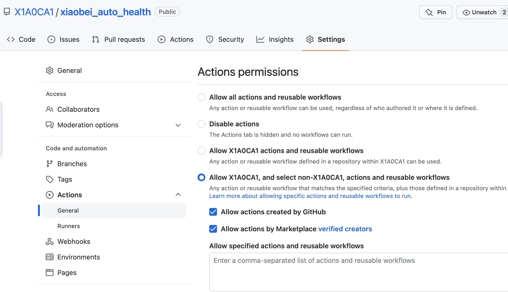

2023 年了，不可能还会有人在用这玩意吧？

<h1 align="center">小北打卡助手</h1>

~~导员再也不用担心我的北温打~~


## 更新方法

参考下面链接，感谢原作者。
https://blog.csdn.net/qq1332479771/article/details/56087333

***如果你是第一次使用，请忽略上面这个，直接看下面的使用方法。***

## 使用方法

### 1. fork 本项目

**在这之前，你可能得先注册一个 github 账号**，然后点击右上角的 Fork 即可。


### 2. 填写你的用户名（身份证号）和密码（默认为身份证号后六位）和位置信息，添加到仓库的 Secrets 中


***请不要无脑照着图抄！！！！！！ 记得替换你身份证号码进去！！！！！！！！！！！！***

请一定要保持`标题（Name）`不变！！！！！！！！

位置信息的标题是`LOCATION`,内容是类似这样的东西`121.1238283,32.12312313`

你可以去这里整一个：

https://api.xiaobaibk.com/api/map/

***这里添加信息不会外泄你的信息！！！！！！！***

***请放心添加！！！！！！***


### 3. 开启 actions


#### 3.1 开启 Workflows

**`点击 Actions`,如果你看到了类似这样的提示，请勇敢的点击 `Enable Workflow`**


### 4. 自己提交一次 push


### 5. 更改 Actions 权限

https://c.m.163.com/news/a/G77KT2TI0511DSSR.html

根据上述报道，为了避免你的 Actions 被别人用去挖矿了，请参考下图更改 Actions 的权限。




### 6. 完成啦\~\~\~\~

***脚本会在每天早上 8 点钟自动为你北温打，导员再也不用担心我的北温打\~\~\~***


### 7. 检查状态

**你可以点击上方的 `Actions` 来查看工作流(workflows)的状态。自己探索下 XJB 点点就好。**


---

### 此外，本项目还支持推送到微信

只需要将你的 SCKEY 按照第二步的方法添加到 github 的 Secrets 并命名为 SCKEY 即可。

***如果你不知道 SCKEY 是什么，你大可以跳过这一步。***

https://sc.ftqq.com/9.version

这里给出一个链接链接到 server 酱。如果你感兴趣 / 想要微信通知，你可以去了解一下，不去了解 、填写 SCKEY 完全不影响脚本的执行。

#### 效果


## 第二种使用方法

首先将本项目 clone 或者下载到本地

然后在 config.py 中写入你的身份证号和密码（默认为身份证号后六位）

注意不要去掉双引号

```python
username = "100000199801020022"
password = "262428"
location = "121.1238283,32.12312313"

```

在完成后，它应该像上面这样

### 运行

```bash
pip3 install requests
# 安装依赖
python3 main.py
# 执行
```

## //TODO

* [x] 3.21 已支持 微信推送
* [x] 随机地点
* [ ] 随机 UA 
* [x] 咕咕咕


## 免责声明

这个项目是纯粹为了学术研究的目的而创建的。 
项目维护者不对软件的滥用、使用负任何责任。

